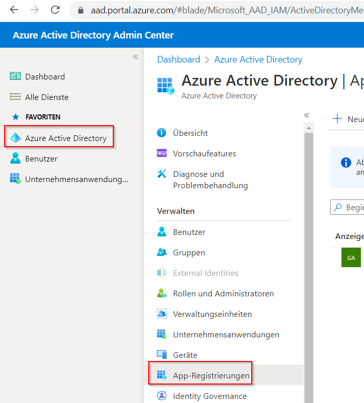
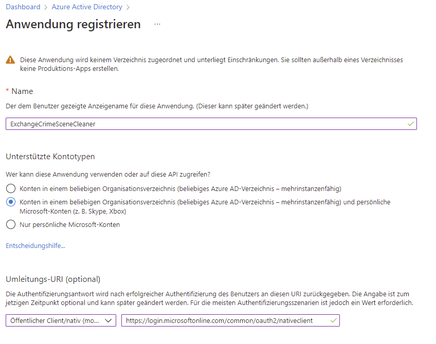
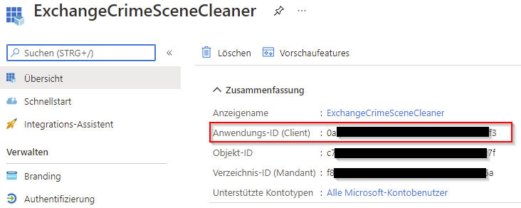
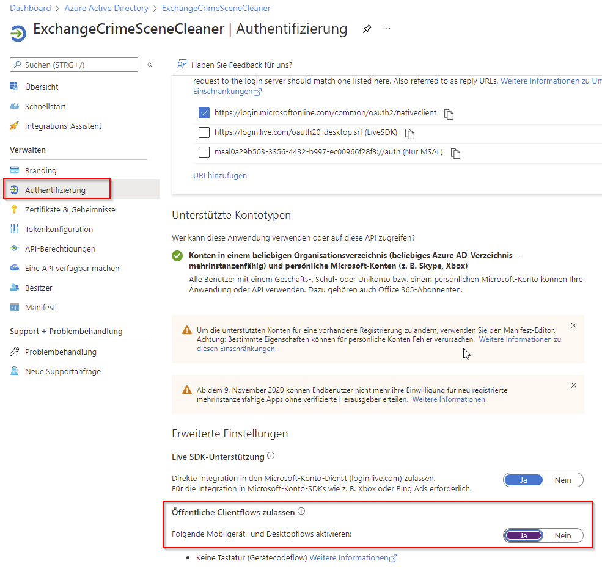

# ExchangeCrimeSceneCleanerCli

see also:
- https://docs.microsoft.com/en-us/graph/tutorials/dotnet-core?context=outlook%2Fcontext 
- https://github.com/microsoftgraph/msgraph-training-dotnet-core
- https://developer.microsoft.com/en-us/graph/quick-start
- https://docs.microsoft.com/en-us/graph/api/resources/contact?view=graph-rest-1.0


## Register App

1. Open a browser and navigate to the [Azure Active Directory admin center](https://aad.portal.azure.com) and login using a **personal account** (aka: Microsoft Account) or **Work or School Account**.

1. Select **Azure Active Directory** in the left-hand navigation, then select **App registrations** under **Manage**.

    

1. Select **New registration**. On the **Register an application** page, set the values as follows.

    - Set **Name** to `ExchangeCrimeSceneCleaner`.
    - Set **Supported account types** to **Accounts in any organizational directory and personal Microsoft accounts**.
    - Under **Redirect URI**, change the dropdown to **Public client (mobile & desktop)**, and set the value to `https://login.microsoftonline.com/common/oauth2/nativeclient`.

    

1. Select **Register**. On the **ExchangeCrimeSceneCleaner** page, copy the value of the **Application (client) ID** and save it, you will need it in the next step.

    

1. Select **Authentication** under **Manage**. Locate the **Advanced settings** section and change the **Allow public client flows** toggle to **Yes**, then choose **Save**.

    


## Setup App

1. Initialize the [.NET development secret store](https://docs.microsoft.com/aspnet/core/security/app-secrets) by opening your CLI in the directory that contains **ExchangeCrimeSceneCleanerCli.csproj** and running the following command.

    ```Shell
    cd src\ExchangeCrimeSceneCleanerCli
    dotnet user-secrets init
    ```

1. Add your application ID and a list of required scopes to the secret store using the following commands. Replace `YOUR_APP_ID_HERE` with the application ID you created in the Azure portal.

    ```Shell
    dotnet user-secrets set appId "YOUR_APP_ID_HERE"
    dotnet user-secrets set scopes "User.Read;MailboxSettings.Read;Calendars.ReadWrite"
    ```

## Build and run

In your command-line interface (CLI), navigate to the project directory and run the following commands.

```Shell
dotnet restore
dotnet build
dotnet run
```